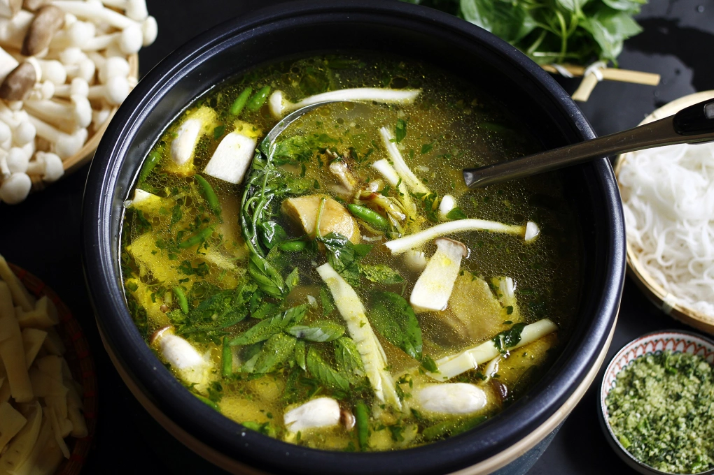

Giới thiệu: 

Dù rất nổi tiếng ở Đà Lạt, lẩu gà lá é lại bắt nguồn từ vùng đất hoa vàng và cỏ xanh Phú Yên. Lá é là một trong những loại rau gia vị đặc trưng tại các tỉnh Nam Trung Bộ và Tây Nguyên, đặc biệt là Phú Yên.

Nguyên liệu

- 1 con gà ta
- 1 bó lá é
- Ớt xiêm xanh, sả, hành tím, tỏi
- Gia vị: Mắm, muối, hạt nêm, đường, hạt tiêu
- Nước dừa hoặc nước khoáng lạt
- Đồ nhúng kèm: Nấm, măng
- Bún hoặc mì sợi